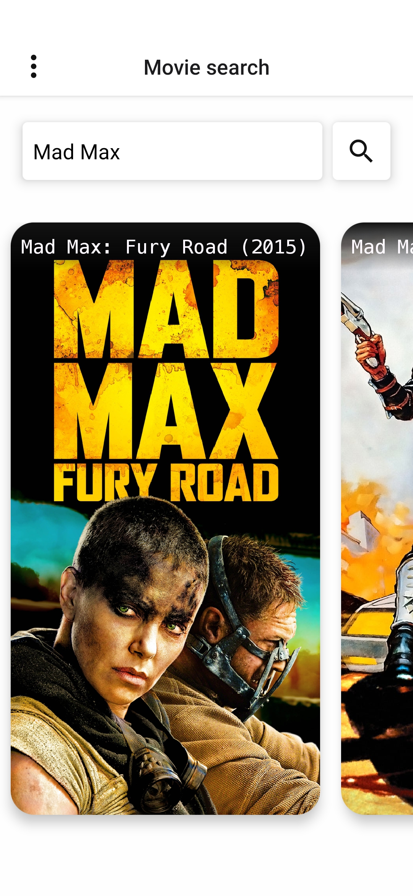
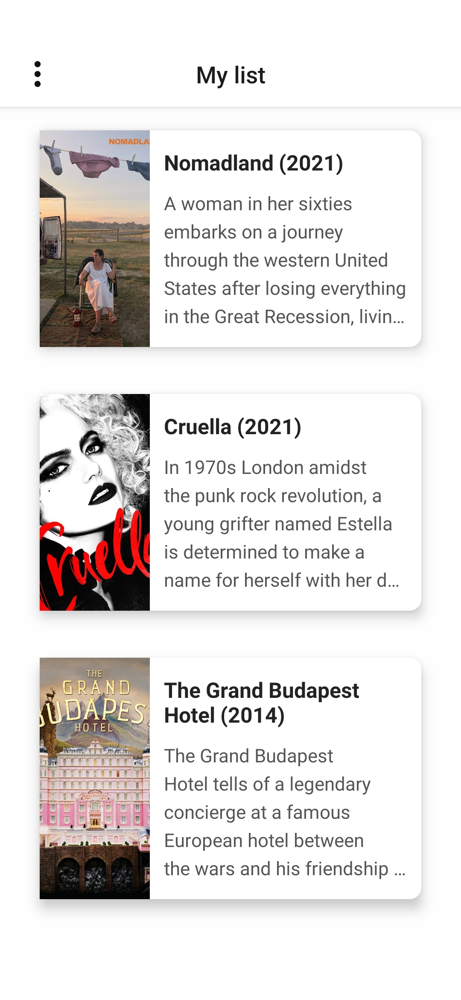

<h3 align="center"></h3>

---

Look it's a simple project built with React Native using Expo and
[The Movie Database API](https://www.themoviedb.org/).

For now, you can use it to search for movies and add then to your list.

If you already have ```yarn``` and ```expo-cli``` installed in your machine, you
can simply run ```expo start``` to test the app in your smartphone using the
Expo App.

### Gallery
|  |  |
|:-:|:-:|
|||